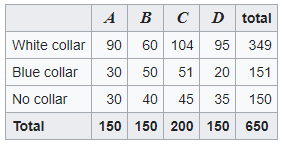

 # Machine Learning & Statistics Tasks 2020 
Tasks 2020 Assessment by Kevin Dooley

#### Background

This repository contains the completed Machine Learning and Statistics Tasks 2020. These tasks are worth 50% of the total marks for this module. All aspects of this project are to be documented in a single Juypter notebook and submitted up to Moodle prior to the project deadline on the 18th December 2020.

Git must be used document your work and marks will be awarded under the following headings: Research, Development, Consistency and Documentation. 

The project description is detailed in full on the GMIT Moodle page under the 'Task 2020 Assessment' PDF.

#### Objective

The aim of this repository is to clearly research and complete all 4 tasks as per the project instructions. All the tasks are focused on statisitical tests and researching and understanding these tasks can only enhance my knowledge of such topics and help me utilise them in future projects and real world situations. 

This respository contains a single Jupyter notebook and a README. The Jupyter notebook discusses each task in detail through supportive code and markdown while the README file decribes how to run the notebook and gives a brief outline about each task. 

#### Getting Started

1. If not already installed, download and install Python 3.
2. Recommend downloading Python via the Anaconda download to get useful additional software including Jupyter and iPython. By downloading Anacoda you will also get essential packages such as; NumPy, Pandas, SciPy already built into Python. All of are used within this project.
3. Download and install a command prompt - recommend Cmder (Windows) or Terminal (Mac).
4. To run this Jupyter notebook on your computer you will need to download the `Tasks 2020.ipynb` file to your desktop. To do this copy the url https://github.com/kevindooley/Machine_Learning_Statistics_Tasks_2020_Assessment which will bring you to the repository. Click the green `Code` button on the screen and then copy the link under the `HTTPS` tab. On the command line, enter `git clone`, paste the url and hit enter. This will then clone the Github repository onto your desktop in your current working directory. 
5. Once cloned/downloaded to your desktop, open your command line
6. Using the 'cd' command on your command line, go to the directory you cloned the .ipynb file to.
7. Type `jupyter notebook` or `jupyter lab` into the command line to open up Jupyter. The Jupyter notebook will then open up in your browser and click on the `Tasks 2020.ipynb` file to view the Jupyter notebook. Note: If your browser does not open with the notebook, go to the command line and it will say `To access the notebook, open this file in a browser:/Or copy and paste one of these URLs:`. Copy one of the provided URLs and paste into a browser of your choosing. The Jupyter homepage containing `Tasks 2020.ipynb` should be shown on your screen. 
8. All cells should be completed and already executed but if you wish to re-run the cells, click the `Kernel` button and then the `Restart & Clear Output` button if you wish to clear all executions and run each cell one by one manually or click `Restart & Run All` if you want to clear all executions and re-run all cells again automatically.
9. To end viewing of the Jupyter notebook, close your browser showing the notebook. Go to the command line and press `CTRL + C` which will terminate the notebook viewing. 
9. You can also view the Jupyter notebook directly on Github by clicking on the link to my repository https://github.com/kevindooley/Machine_Learning_Statistics_Tasks_2020_Assessment. All commits to this repository can be viewed on Github.
10. Sometimes, the Jupyter notebook does not always load on Githib, you can also view on nbviewer using the link https://github.com/kevindooley/Machine_Learning_Statistics_Tasks_2020_Assessment

#### Python Packages used in this project

1. NumPy is a package for Python for scientific computing. It supports large, multidimensional arrays and matrices, meaning it has a wide array of applications specifically used to generate pseudo arrays and do simulations. 
2. SciPy is a Python-based open-source library for scientific computing and mathematics. It contains modules that support optimisation, linear algebra, integration and inerpolation. 
3. Seaborn is a high-level Python data visualisation library used for making attractive and informative statistical plots. It acts as a wrapper over matplotlib, and it’s used in conjunction with NumPy and pandas data structures
4. Matplotlib similar to seaborn is a toolkit used the visualisation of data. Matplotlib is a Python 2D plotting library which produces publication quality figures in a variety of hardcopy formats and interactive environments across platforms.

#### Task 1 - The Square Root of 2
Write a Python function called  $\𝑠𝑞𝑟𝑡2$  that calculates and prints to the screen the square root of 2 to 100 decimal places. The solutions should be identified without using any built in Python libraries. Contained in this task is research into the topic, a desciption of the algorithm and all relevant references.

There is a few variations to determining the square root of 2 - the method that is mainly discussed is the Newton-Raphson method which is a root-finding algorithm that produces successively better approximations of the roots of a real-valued function. Using this method it is possible to compute the square root of 2 but to do so, the input number must be increased at the start of algorithm and dividied back down accordingly at the end. This is because of python's limitation of floating point precision.

#### Task 2 - Chi-squared Test
This task is to analyse whether two categorical variables (neighboorhood and occupation) are independent using the Chi-squared test for independence. Using the module package scipy.stats, verify that the Chi-squared value on [wikipedia](https://en.wikipedia.org/wiki/Chi-squared_test) of 24.6 is correct and calculate the associated 𝑝 value for the example shown on the [wikipedia](https://en.wikipedia.org/wiki/Chi-squared_test) page of the Chi-squared test. 

A chi-squared test, also written as `𝜒2` test, is a statistical hypothesis test that is valid to perform when the test statistic is chi-squared distributed under the null hypothesis. Chi-square test for independence compares two variables in a contingency table to see if they are related and it tests to see whether distributions of categorical variables differ from each another. 

In the example on wikipedia, the chi-squared result is 24.6. Using SciPy, I demonstarted that 24.6 was the correct result and that the variables neighbourhood and occupation are  dependent of each other and not independent